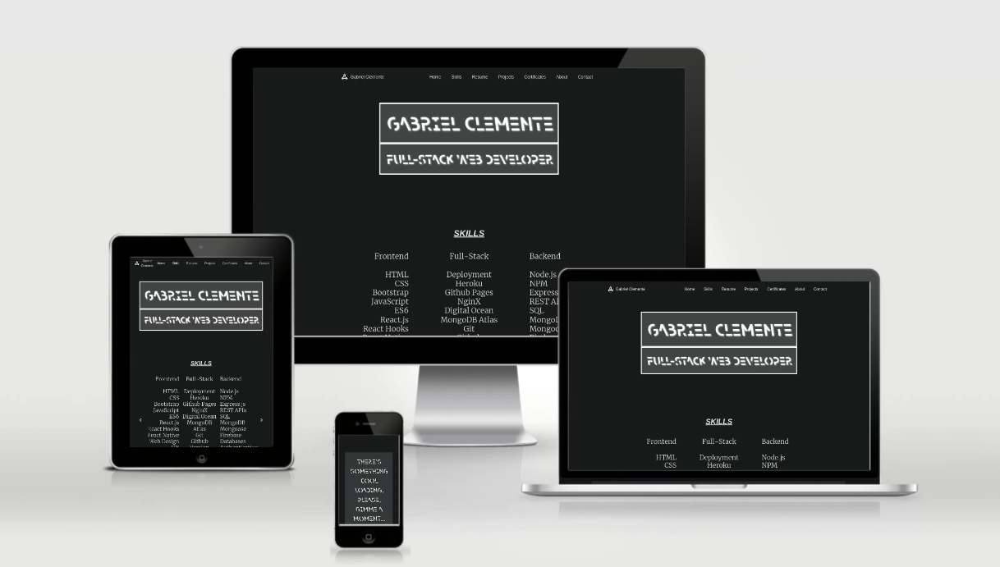

<p align="center"># Gabriel Clemente's Personal Website</p>





Hi everyone! This is my personal website where you can see some of my work as a web developer. It's been developed using HTML, CSS and a bit of JavaScript. 

About the graphic design it's thought to make it easy to read. The chosen colors basically, #444, #fff, #000, are the ones that harm less the viewers eyes, so you can keep staring for hours to the page. Also the typography used it's the easiest to read and process for humans. 

## Getting Started

Well, just visit the website at [gabo.rocks](https://gabo.rocks) and enjoy! 

### You want to own this website?

On the other hand if you'd like to host this website on your local machine just clone this repository with ```git clone https://github.com/gabriel19971029/Portfolio.git```. just copy and paste that command on your terminal and start a local server. That's it.

## Deployment

This website it's been deployed and made available to the public thanks to Github Pages, which is a completely free hosting for single page applications.

## Built With

* [JavaScript](https://www.javascript.com/) - The web programming languaje
* [jQuery](https://jquery.com/) - The library to write less while doing more
* [HTML](https://html.com/) - Your favourite Markup Languaje
* [CSS](https://www.css3.info/) - Used to stylize this awesome website
* [Bootstrap](https://getbootstrap.com/) - The library that makes frontend developers out of backend guys

## Contributing

  Like, share, subscribe, follow and join my Patreon! Just kidding this is totally for free. 

## Authors

* **Gabriel Clemente, aka Gabo, your favourite web developer.** - *Initial work* - [Gabo](https://github.com/gabriel19971029)

## License

This project is licensed under the Creative Commons Public Domain License - Feel free to copy the code, I did it too.

<p align="center"></p>


## Acknowledgments

* Thanks to Twitter for making Bootstrap open source, and to John Resig for creating JQuery, and about all and foremost to Brendan Eich for developing our beloved and hated headache called JavaScript.
